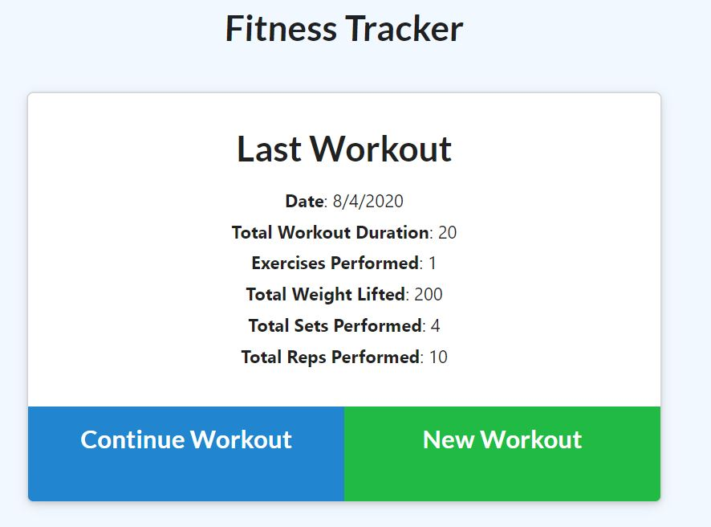
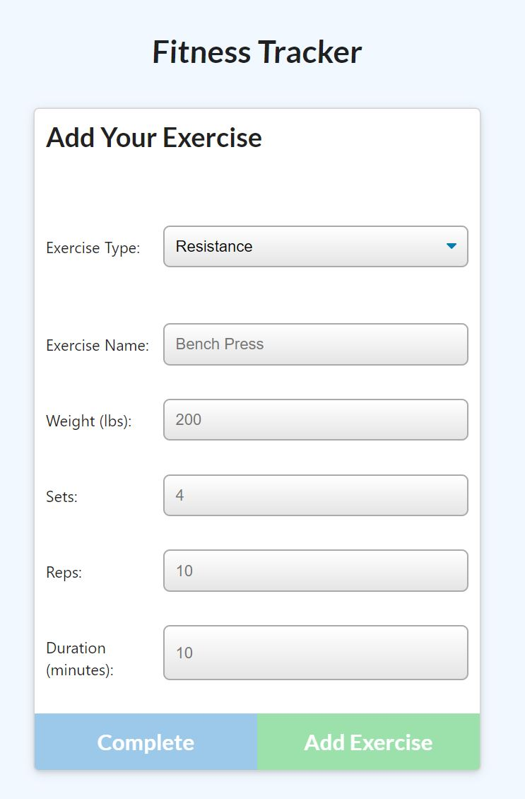
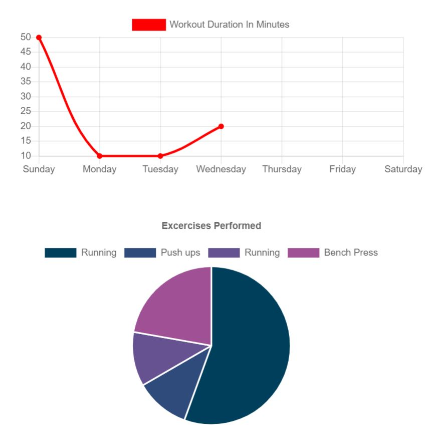

# HW17-Workout-Tracker

## Description-

- This is a workout tracker where the front-end code was given. It uses a Mongo database with Mongoose schema and handle routes with Express to store data and log multiple exercises. 

## Table of Contents
- [Technologies Used](#technologies-used)
- [Installation](#installation)
- [License](#license)
- [Webpage Display](#webpage-display)
- [Gif Walkthrough](#gif-walkthrough)

## Technologies Used:
---
1. HTML
2. Javascript
3. Bootstrap
4. Charts
5. Node
6. MongoDB Compass
---

## Installation:
```
npm express
npm mongoDB
npm mongoose
npm logger
```

## License-
  License used: 

## Webpage Display:



- Shows the last workout and the user can either continue the workout or create a new workout. 



- The user can pick between cardio or resistance as options and then be prompted to enter the name, weight, sets, reps, and duration.



- This is where charts.js was used to track the duration for each exercise and a pie chart to display the segments of time dedicated to a exercise vs the total amount of time.
